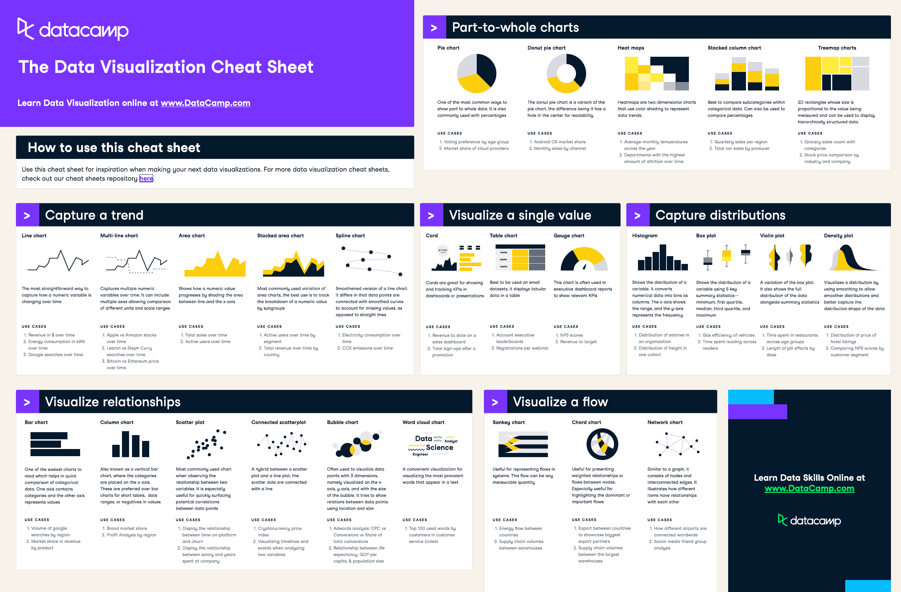

# 📊 Data Visualization – Chart Types Documentation

## 1. Charts for Trends (Change Over Time)
Used to show how values evolve across time.

### Line Chart
- Shows change in a numeric variable over time  
- Best for continuous data  
- Example: Stock prices, temperature trends  

### Multi-Line Chart
- Multiple lines to compare trends  
- Useful for comparing categories over time  

### Area Chart
- Similar to line chart but with filled area  
- Emphasizes magnitude of change  

### Stacked Area Chart
- Shows total + contribution of subcategories  
- Useful for composition over time  

### Spline Chart
- Smoothed line chart  
- Handles missing or irregular data better  

---

## 2. Charts for Relationships (Correlation & Comparison)

### Bar Chart
- Compares categories  
- One axis = categories, other = values  

### Column Chart
- Vertical version of bar chart  
- Better for time or ordered categories  

### Scatter Plot
- Shows relationship between two variables  
- Used to identify correlation  

### Connected Scatter Plot
- Scatter plot + line  
- Shows sequence or progression  

### Bubble Chart
- Adds a third dimension using size  
- Useful for multi-variable analysis  

### Word Cloud
- Visualizes frequency of words  
- Used in text analysis  

---

## 3. Charts for Part-to-Whole (Composition)

### Pie Chart
- Shows proportions as slices  
- Works best with few categories  

### Donut Chart
- Pie chart with center hole  
- Cleaner visual for dashboards  

### Stacked Column Chart
- Shows subcategories within totals  
- Good for comparing grouped data  

### Treemap
- Uses rectangles sized by value  
- Best for hierarchical data  

### Heatmap
- Uses color intensity to show values  
- Good for patterns across two dimensions  

---

## 4. Charts for Single Value (KPIs & Metrics)

### Card (KPI)
- Displays one key metric  
- Example: Revenue, users, uptime  

### Table
- Shows exact values in rows/columns  
- Best for detailed data  

### Gauge Chart
- Displays performance vs target  
- Often used in dashboards  

---

## 5. Charts for Distribution (Data Spread)

### Histogram
- Groups values into bins  
- Shows frequency distribution  

### Box Plot
- Displays min, max, median, quartiles  
- Highlights outliers  

### Violin Plot
- Combines box plot + density  
- Shows full distribution shape  

### Density Plot
- Smoothed version of histogram  
- Better for continuous patterns  

---

## 6. Charts for Flow & Networks

### Sankey Diagram
- Shows flow between stages  
- Thickness = quantity  

### Chord Diagram
- Displays relationships between entities  
- Circular flow visualization  

### Network Chart
- Nodes + edges  
- Shows connections between items  

---

# 🧠 How to Choose the Right Chart

| Goal | Chart Type |
|------|-----------|
| Trend over time | Line, Area |
| Compare categories | Bar, Column |
| Show relationships | Scatter, Bubble |
| Show composition | Pie, Treemap |
| Show distribution | Histogram, Box Plot |
| Show flow | Sankey, Network |

---

# ⚠️ Common Mistakes
- Using pie charts with too many categories  
- Overloading charts with too many variables  
- Misleading axis scaling  
- Choosing aesthetics over clarity  

---

# ✅ Summary
- Charts are not just visuals—they are communication tools  
- Every chart type answers a specific analytical question  
- The key skill is not knowing all charts, but choosing the right one  